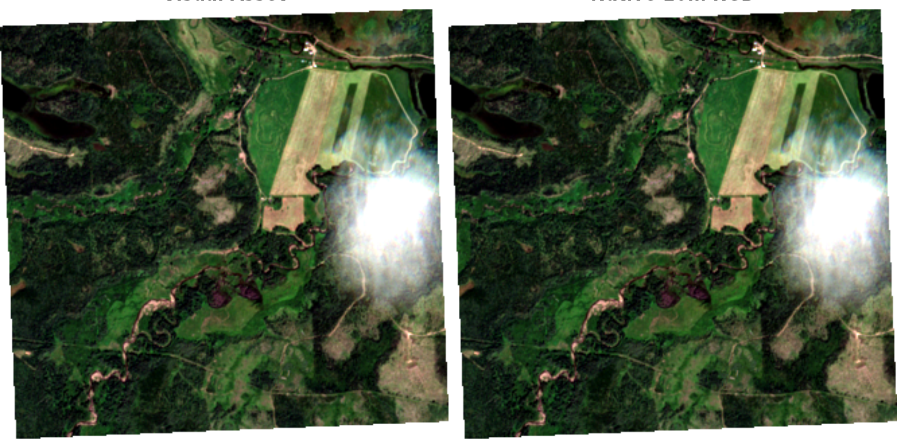

# STAC ortho timelapse

``` r
library(ngr)
```

## Planetary Computer Collections

The [Microsoft Planetary
Computer](https://planetarycomputer.microsoft.com/) hosts a STAC catalog
with numerous Earth observation datasets. We can use `rstac` to query
the available collections directly from the API:

``` r
stac_url <- "https://planetarycomputer.microsoft.com/api/stac/v1"

# Fetch all collections from the Planetary Computer STAC catalog
collections <- rstac::stac(stac_url) |>
  rstac::collections() |>
  rstac::get_request()

# determin which dtasets overlap bc
# bc_bbox <- c(-139, 48, -114, 60)

 #100km buffer from the us border to not overlap all the us dtasets 
bc_bbox <- c(-139, 49.5, -114, 60)

bc_overlap <-  purrr::keep(collections$collections, ~ {

  bbox <- .x$extent$spatial$bbox[[1]]
  bbox[1] <= bc_bbox[3] && bbox[3] >= bc_bbox[1] &&
   bbox[2] <= bc_bbox[4] && bbox[4] >= bc_bbox[2]
  }) |>
  purrr::map_chr("id")

# Extract collection IDs and descriptions into a data frame
collections_df <- purrr::map_df(collections$collections, ~ {
    interval <- .x$extent$temporal$interval[[1]]
    data.frame(
      id = .x$id,
      start = interval[[1]],
      end = interval[[2]],
      description = paste0(.x$title, ": ", paste(.x$keywords %||% NA_character_, collapse = ", ")),
      check.names = FALSE
    )
  }) |>
    dplyr::mutate(
      start = as.Date(start),
      end = as.Date(end),
      # rowid = dplyr::row_number(),
      bc_overlap = dplyr::if_else(id %in% bc_overlap, "yes", "no"), .after = id
    ) |> 
  dplyr::arrange(id)


collections_df |> 
  kableExtra::kbl() |> 
  kableExtra::scroll_box(width = "100%", height = "500px") |> 
  kableExtra::kable_styling(c("condensed", 
        "responsive"), full_width = T, font_size = 10)
```

| id                                                     | bc_overlap | start      | end        | description                                                                                                                                                                                                       |
|:-------------------------------------------------------|:-----------|:-----------|:-----------|:------------------------------------------------------------------------------------------------------------------------------------------------------------------------------------------------------------------|
| 3dep-lidar-classification                              | yes        | 2012-01-01 | 2022-01-01 | USGS 3DEP Lidar Classification: USGS, 3DEP, COG, Classification                                                                                                                                                   |
| 3dep-lidar-copc                                        | yes        | 2012-01-01 | 2022-01-01 | USGS 3DEP Lidar Point Cloud: USGS, 3DEP, COG, Point cloud                                                                                                                                                         |
| 3dep-lidar-dsm                                         | yes        | 2012-01-01 | 2022-01-01 | USGS 3DEP Lidar Digital Surface Model: USGS, 3DEP, COG, DSM                                                                                                                                                       |
| 3dep-lidar-dtm                                         | yes        | 2012-01-01 | 2022-01-01 | USGS 3DEP Lidar Digital Terrain Model: USGS, 3DEP, COG, DTM                                                                                                                                                       |
| 3dep-lidar-dtm-native                                  | yes        | 2012-01-01 | 2022-01-01 | USGS 3DEP Lidar Digital Terrain Model (Native): USGS, 3DEP, COG, DTM                                                                                                                                              |
| 3dep-lidar-hag                                         | yes        | 2012-01-01 | 2022-01-01 | USGS 3DEP Lidar Height above Ground: USGS, 3DEP, COG, Elevation                                                                                                                                                   |
| 3dep-lidar-intensity                                   | yes        | 2012-01-01 | 2022-01-01 | USGS 3DEP Lidar Intensity: USGS, 3DEP, COG, Intensity                                                                                                                                                             |
| 3dep-lidar-pointsourceid                               | yes        | 2012-01-01 | 2022-01-01 | USGS 3DEP Lidar Point Source: USGS, 3DEP, COG, PointSourceId                                                                                                                                                      |
| 3dep-lidar-returns                                     | yes        | 2012-01-01 | 2022-01-01 | USGS 3DEP Lidar Returns: USGS, 3DEP, COG, NumberOfReturns                                                                                                                                                         |
| 3dep-seamless                                          | yes        | 1925-01-01 | 2020-05-06 | USGS 3DEP Seamless DEMs: USGS, 3DEP, NED, Elevation, DEM                                                                                                                                                          |
| alos-dem                                               | yes        | 2016-12-07 | 2016-12-07 | ALOS World 3D-30m: ALOS, PRISM, JAXA, DEM, DSM, Elevation                                                                                                                                                         |
| alos-fnf-mosaic                                        | no         | 2015-01-01 | 2020-12-31 | ALOS Forest/Non-Forest Annual Mosaic: ALOS, JAXA, Forest, Land Cover, Global                                                                                                                                      |
| alos-palsar-mosaic                                     | no         | 2015-01-01 | 2021-12-31 | ALOS PALSAR Annual Mosaic: ALOS, JAXA, Remote Sensing, Global                                                                                                                                                     |
| aster-l1t                                              | yes        | 2000-03-04 | 2006-12-31 | ASTER L1T: ASTER, USGS, NASA, Satellite, Global                                                                                                                                                                   |
| chesapeake-lc-13                                       | no         | 2013-01-01 | 2014-12-31 | Chesapeake Land Cover (13-class): Land Cover, Chesapeake Bay Watershed, Chesapeake Conservancy                                                                                                                    |
| chesapeake-lc-7                                        | no         | 2013-01-01 | 2014-12-31 | Chesapeake Land Cover (7-class): Land Cover, Chesapeake Bay Watershed, Chesapeake Conservancy                                                                                                                     |
| chesapeake-lu                                          | no         | 2013-01-01 | 2014-12-31 | Chesapeake Land Use: Land Use, Chesapeake Bay Watershed, Chesapeake Conservancy                                                                                                                                   |
| chloris-biomass                                        | yes        | 2003-07-31 | 2019-07-31 | Chloris Biomass: Chloris, Biomass, MODIS, Carbon                                                                                                                                                                  |
| cil-gdpcir-cc-by                                       | yes        | 1950-01-01 | 2100-12-31 | CIL Global Downscaled Projections for Climate Impacts Research (CC-BY-4.0): CMIP6, Climate Impact Lab, Rhodium Group, Precipitation, Temperature                                                                  |
| cil-gdpcir-cc-by-sa                                    | yes        | 1950-01-01 | 2100-12-31 | CIL Global Downscaled Projections for Climate Impacts Research (CC-BY-SA-4.0): CMIP6, Climate Impact Lab, Rhodium Group, Precipitation, Temperature                                                               |
| cil-gdpcir-cc0                                         | yes        | 1950-01-01 | 2100-12-31 | CIL Global Downscaled Projections for Climate Impacts Research (CC0-1.0): CMIP6, Climate Impact Lab, Rhodium Group, Precipitation, Temperature                                                                    |
| conus404                                               | yes        | 1979-10-01 | 2022-09-30 | CONUS404: CONUS404, Hydroclimate, Hydrology, Inland Waters, Precipitation, Weather, Climate                                                                                                                       |
| cop-dem-glo-30                                         | yes        | 2021-04-22 | 2021-04-22 | Copernicus DEM GLO-30: Copernicus, DEM, DSM, Elevation                                                                                                                                                            |
| cop-dem-glo-90                                         | yes        | 2021-04-22 | 2021-04-22 | Copernicus DEM GLO-90: Copernicus, DEM, Elevation                                                                                                                                                                 |
| daymet-annual-hi                                       | no         | 1980-07-01 | 2020-07-01 | Daymet Annual Hawaii: Daymet, Hawaii, Temperature, Precipitation, Vapor Pressure, Climate                                                                                                                         |
| daymet-annual-na                                       | yes        | 1980-07-01 | 2020-07-01 | Daymet Annual North America: Daymet, North America, Temperature, Precipitation, Vapor Pressure, Climate                                                                                                           |
| daymet-annual-pr                                       | no         | 1980-07-01 | 2020-07-01 | Daymet Annual Puerto Rico: Daymet, Puerto Rico, Temperature, Precipitation, Vapor Pressure, Climate                                                                                                               |
| daymet-daily-hi                                        | no         | 1980-01-01 | 2020-12-30 | Daymet Daily Hawaii: Daymet, Hawaii, Temperature, Precipitation, Vapor Pressure, Weather                                                                                                                          |
| daymet-daily-na                                        | yes        | 1980-01-01 | 2020-12-30 | Daymet Daily North America: Daymet, North America, Temperature, Precipitation, Vapor Pressure, Weather                                                                                                            |
| daymet-daily-pr                                        | no         | 1980-01-01 | 2020-12-30 | Daymet Daily Puerto Rico: Daymet, Puerto Rico, Temperature, Precipitation, Vapor Pressure, Weather                                                                                                                |
| daymet-monthly-hi                                      | no         | 1980-01-16 | 2020-12-16 | Daymet Monthly Hawaii: Daymet, Hawaii, Temperature, Precipitation, Vapor Pressure, Climate                                                                                                                        |
| daymet-monthly-na                                      | yes        | 1980-01-16 | 2020-12-16 | Daymet Monthly North America: Daymet, North America, Temperature, Precipitation, Vapor Pressure, Climate                                                                                                          |
| daymet-monthly-pr                                      | no         | 1980-01-16 | 2020-12-16 | Daymet Monthly Puerto Rico: Daymet, Puerto Rico, Temperature, Precipitation, Vapor Pressure, Climate                                                                                                              |
| deltares-floods                                        | no         | 2018-01-01 | 2018-12-31 | Deltares Global Flood Maps: Deltares, Flood, Sea level rise, Water, Global                                                                                                                                        |
| deltares-water-availability                            | no         | 1970-01-01 | 2020-12-31 | Deltares Global Water Availability: Deltares, Water availability, Reservoir, Water, Precipitation                                                                                                                 |
| drcog-lulc                                             | no         | 2018-01-01 | 2020-12-31 | Denver Regional Council of Governments Land Use Land Cover: Land Cover, Land Use, NAIP, USDA                                                                                                                      |
| eclipse                                                | no         | 2021-01-01 | NA         | Urban Innovation Eclipse Sensor Data: Eclipse, PM25, air pollution                                                                                                                                                |
| ecmwf-forecast                                         | no         | NA         | NA         | ECMWF Open Data (real-time): ECMWF, forecast, weather                                                                                                                                                             |
| era5-pds                                               | yes        | 1979-01-01 | NA         | ERA5 - PDS: ERA5, ECMWF, Precipitation, Temperature, Reanalysis, Weather                                                                                                                                          |
| esa-cci-lc                                             | yes        | 1992-01-01 | 2020-12-31 | ESA Climate Change Initiative Land Cover Maps (Cloud Optimized GeoTIFF): Land Cover, ESA, CCI, Global                                                                                                             |
| esa-cci-lc-netcdf                                      | yes        | 1992-01-01 | 2020-12-31 | ESA Climate Change Initiative Land Cover Maps (NetCDF): Land Cover, ESA, CCI, Global                                                                                                                              |
| esa-worldcover                                         | yes        | 2020-01-01 | 2021-12-31 | ESA WorldCover: Global, Land Cover, Sentinel, ESA                                                                                                                                                                 |
| fia                                                    | no         | 2020-06-01 | NA         | Forest Inventory and Analysis: Forest, Species, Carbon, Biomass, USDA, Forest Service                                                                                                                             |
| fws-nwi                                                | no         | 2022-10-01 | 2022-10-01 | FWS National Wetlands Inventory: USFWS, Wetlands, United States                                                                                                                                                   |
| gap                                                    | yes        | 1999-01-01 | 2011-12-31 | USGS Gap Land Cover: USGS, GAP, LANDFIRE, Land Cover, United States                                                                                                                                               |
| gbif                                                   | yes        | 2021-04-13 | NA         | Global Biodiversity Information Facility (GBIF): GBIF, Biodiversity, Species                                                                                                                                      |
| gnatsgo-rasters                                        | no         | 2020-07-01 | 2020-07-01 | gNATSGO Soil Database - Rasters: Soils, NATSGO, SSURGO, STATSGO2, RSS, USDA, United States                                                                                                                        |
| gnatsgo-tables                                         | no         | 2020-07-01 | 2020-07-01 | gNATSGO Soil Database - Tables: Soils, NATSGO, SSURGO, STATSGO2, RSS, USDA, United States                                                                                                                         |
| goes-cmi                                               | yes        | 2017-02-28 | NA         | GOES-R Cloud & Moisture Imagery: GOES, NOAA, NASA, Satellite, Cloud, Moisture                                                                                                                                     |
| goes-glm                                               | yes        | 2018-02-13 | NA         | GOES-R Lightning Detection: GOES, NOAA, NASA, Satellite, Lightning, Weather                                                                                                                                       |
| gpm-imerg-hhr                                          | yes        | 2000-06-01 | 2021-05-31 | GPM IMERG: IMERG, GPM, Precipitation                                                                                                                                                                              |
| gridmet                                                | no         | 1979-01-01 | 2020-12-31 | gridMET: gridMET, Water, Precipitation, Temperature, Vapor Pressure, Climate                                                                                                                                      |
| hgb                                                    | yes        | 2010-12-31 | 2010-12-31 | HGB: Harmonized Global Biomass for 2010: Biomass, Carbon, ORNL                                                                                                                                                    |
| hls2-l30                                               | yes        | 2020-01-01 | NA         | Harmonized Landsat Sentinel-2 (HLS) Version 2.0, Landsat Data: Sentinel, Landsat, HLS, Satellite, Global, Imagery                                                                                                 |
| hls2-s30                                               | yes        | 2020-01-01 | NA         | Harmonized Landsat Sentinel-2 (HLS) Version 2.0, Sentinel-2 Data: Sentinel, Landsat, HLS, Satellite, Global, Imagery                                                                                              |
| hrea                                                   | no         | 2012-12-31 | 2019-12-31 | HREA: High Resolution Electricity Access: HREA, Electricity, VIIRS                                                                                                                                                |
| io-biodiversity                                        | yes        | 2017-01-01 | 2020-12-31 | Biodiversity Intactness: Global, Biodiversity                                                                                                                                                                     |
| io-lulc                                                | yes        | 2017-01-01 | 2021-01-01 | Esri 10-Meter Land Cover (10-class): Global, Land Cover, Land Use, Sentinel                                                                                                                                       |
| io-lulc-9-class                                        | yes        | 2017-01-01 | 2023-01-01 | 10m Annual Land Use Land Cover (9-class) V1: Global, Land Cover, Land Use, Sentinel                                                                                                                               |
| io-lulc-annual-v02                                     | yes        | 2017-01-01 | 2024-01-01 | 10m Annual Land Use Land Cover (9-class) V2: Global, Land Cover, Land Use, Sentinel                                                                                                                               |
| jrc-gsw                                                | yes        | 1984-03-01 | 2020-12-31 | JRC Global Surface Water: Global, Water, Landsat                                                                                                                                                                  |
| kaza-hydroforecast                                     | no         | 2022-01-01 | NA         | HydroForecast - Kwando & Upper Zambezi Rivers: Water, HydroForecast, Streamflow, Hydrology, Upstream Tech                                                                                                         |
| landsat-c2-l1                                          | yes        | 1972-07-25 | 2013-01-07 | Landsat Collection 2 Level-1: Landsat, USGS, NASA, Satellite, Global, Imagery                                                                                                                                     |
| landsat-c2-l2                                          | yes        | 1982-08-22 | NA         | Landsat Collection 2 Level-2: Landsat, USGS, NASA, Satellite, Global, Imagery, Reflectance, Temperature                                                                                                           |
| met-office-global-deterministic-height                 | yes        | 2023-12-15 | NA         | Height levels collection Met Office Global 10km deterministic weather forecast: Met Office, Weather, Forecast, Global, Cloud                                                                                      |
| met-office-global-deterministic-near-surface           | yes        | 2023-12-15 | NA         | Near-surface level collection Met Office global deterministic 10km forecast: Met Office, Global, Forecast, Cloud, Fog, Heat Flux, Precipitation, Pressure, Radiation, Rainfall, Humidity, Snow, Temperature, Wind |
| met-office-global-deterministic-pressure               | yes        | 2023-12-15 | NA         | Pressure levels collection Met Office Global 10km deterministic weather forecast: MetOffice, Global, Cloud                                                                                                        |
| met-office-uk-deterministic-height                     | no         | 2023-12-15 | NA         | Height levels collection Met Office UKV 2km deterministic forecast: Met Office, Weather, Forecast, UK, Cloud, Temperature, Wind, Height                                                                           |
| met-office-uk-deterministic-near-surface               | no         | 2023-12-15 | NA         | Near-surface level collection Met Office UKV 2km deterministic forecast: Met Office, Weather, Forecast, UK, Precipitation, Temperature, Wind, Pressure, Humidity                                                  |
| met-office-uk-deterministic-pressure                   | no         | 2023-12-15 | NA         | Pressure levels collection Met Office UKV 2km deterministic forecast: Met Office, Weather, Forecast, UK, Temperature, Wind, Pressure, Humidity                                                                    |
| met-office-uk-deterministic-whole-atmosphere           | no         | 2023-12-15 | NA         | Whole Atmosphere collection Met Office UKV 2km deterministic forecast: Met Office, Weather, Forecast, UK, CAPE, Cloud, Freezing, Wet Bulb, Lightning                                                              |
| met-office-uk-deterministic-whole-atmosphere-          | no         | 2023-12-15 | NA         | Whole Atmosphere collection Met Office UKV 2km deterministic forecast: Met Office, Weather, Forecast, UK, CAPE, Cloud, Freezing, Wet Bulb, Lightning                                                              |
| mobi                                                   | no         | 2020-04-14 | 2020-04-14 | MoBI: Map of Biodiversity Importance: MoBI, Natureserve, United States, Biodiversity                                                                                                                              |
| modis-09A1-061                                         | yes        | 2000-02-18 | NA         | MODIS Surface Reflectance 8-Day (500m): NASA, MODIS, Satellite, Imagery, Global, Reflectance, MOD09A1, MYD09A1                                                                                                    |
| modis-09Q1-061                                         | yes        | 2000-02-18 | NA         | MODIS Surface Reflectance 8-Day (250m): NASA, MODIS, Satellite, Imagery, Global, Reflectance, MOD09Q1, MYD09Q1                                                                                                    |
| modis-10A1-061                                         | yes        | 2000-02-24 | NA         | MODIS Snow Cover Daily: NASA, MODIS, Satellite, Global, Snow, MOD10A1, MYD10A1                                                                                                                                    |
| modis-10A2-061                                         | yes        | 2000-02-18 | NA         | MODIS Snow Cover 8-day: NASA, MODIS, Satellite, Global, Snow, MOD10A2, MYD10A2                                                                                                                                    |
| modis-11A1-061                                         | yes        | 2000-02-24 | NA         | MODIS Land Surface Temperature/Emissivity Daily: NASA, MODIS, Satellite, Global, Temperature, MOD11A1, MYD11A1                                                                                                    |
| modis-11A2-061                                         | yes        | 2000-02-18 | NA         | MODIS Land Surface Temperature/Emissivity 8-Day: NASA, MODIS, Satellite, Global, Temperature, MOD11A2, MYD11A2                                                                                                    |
| modis-13A1-061                                         | yes        | 2000-02-18 | NA         | MODIS Vegetation Indices 16-Day (500m): NASA, MODIS, Satellite, Global, Vegetation, MOD13A1, MYD13A1                                                                                                              |
| modis-13Q1-061                                         | yes        | 2000-02-18 | NA         | MODIS Vegetation Indices 16-Day (250m): NASA, MODIS, Satellite, Global, Vegetation, MOD13Q1, MYD13Q1                                                                                                              |
| modis-14A1-061                                         | yes        | 2000-02-18 | NA         | MODIS Thermal Anomalies/Fire Daily: NASA, MODIS, Satellite, Global, Fire, MOD14A1, MYD14A1                                                                                                                        |
| modis-14A2-061                                         | yes        | 2000-02-18 | NA         | MODIS Thermal Anomalies/Fire 8-Day: NASA, MODIS, Satellite, Global, Fire, MOD14A2, MYD14A2                                                                                                                        |
| modis-15A2H-061                                        | yes        | 2002-07-04 | NA         | MODIS Leaf Area Index/FPAR 8-Day: NASA, MODIS, Satellite, Global, Vegetation, MCD15A2H, MOD15A2H, MYD15A2H                                                                                                        |
| modis-15A3H-061                                        | yes        | 2002-07-04 | NA         | MODIS Leaf Area Index/FPAR 4-Day: NASA, MODIS, Satellite, Global, Vegetation, MCD15A3H                                                                                                                            |
| modis-16A3GF-061                                       | yes        | 2001-01-01 | NA         | MODIS Net Evapotranspiration Yearly Gap-Filled: NASA, MODIS, Satellite, Global, Vegetation, MOD16A3GF, MYD16A3GF                                                                                                  |
| modis-17A2H-061                                        | yes        | 2000-02-18 | NA         | MODIS Gross Primary Productivity 8-Day: NASA, MODIS, Satellite, Vegetation, Global, MOD17A2H, MYD17A2H                                                                                                            |
| modis-17A2HGF-061                                      | yes        | 2000-02-18 | NA         | MODIS Gross Primary Productivity 8-Day Gap-Filled: NASA, MODIS, Satellite, Vegetation, Global, MOD17A2HGF, MYD17A2HGF                                                                                             |
| modis-17A3HGF-061                                      | yes        | 2000-02-18 | NA         | MODIS Net Primary Production Yearly Gap-Filled: NASA, MODIS, Satellite, Vegetation, Global, MOD17A3HGF, MYD17A3HGF                                                                                                |
| modis-21A2-061                                         | yes        | 2000-02-16 | NA         | MODIS Land Surface Temperature/3-Band Emissivity 8-Day: NASA, MODIS, Satellite, Global, Temperature, MOD21A2, MYD21A2                                                                                             |
| modis-43A4-061                                         | yes        | 2000-02-16 | NA         | MODIS Nadir BRDF-Adjusted Reflectance (NBAR) Daily: NASA, MODIS, Satellite, Imagery, Global, Reflectance, MCD43A4                                                                                                 |
| modis-64A1-061                                         | yes        | 2000-11-01 | NA         | MODIS Burned Area Monthly: NASA, MODIS, Satellite, Imagery, Global, Fire, MCD64A1                                                                                                                                 |
| ms-buildings                                           | no         | 2014-01-01 | NA         | Microsoft Building Footprints: Bing Maps, Buildings, geoparquet, Microsoft, Footprint, Delta                                                                                                                      |
| mtbs                                                   | yes        | 1984-12-31 | 2018-12-31 | MTBS: Monitoring Trends in Burn Severity: MTBS, USGS, USFS, USDA, Forest, Fire                                                                                                                                    |
| naip                                                   | no         | 2010-01-01 | 2023-12-31 | NAIP: National Agriculture Imagery Program: NAIP, Aerial, Imagery, USDA, AFPO, Agriculture, United States                                                                                                         |
| nasa-nex-gddp-cmip6                                    | yes        | 1950-01-01 | 2100-12-31 | Earth Exchange Global Daily Downscaled Projections (NEX-GDDP-CMIP6): CMIP6, NASA, Climate, Humidity, Precipitation, Temperature                                                                                   |
| nasadem                                                | yes        | 2000-02-20 | 2000-02-20 | NASADEM HGT v001: NASA, JPL, Elevation, DEM, USGS, NGA, SRTM                                                                                                                                                      |
| noaa-c-cap                                             | no         | 1975-01-01 | 2016-12-31 | C-CAP Regional Land Cover and Change: Land Cover, Land Use, NOAA, Coastal                                                                                                                                         |
| noaa-cdr-ocean-heat-content                            | yes        | 1972-03-01 | 2022-03-31 | Global Ocean Heat Content CDR: Global, Climate, NOAA, Temperature, Ocean                                                                                                                                          |
| noaa-cdr-ocean-heat-content-netcdf                     | yes        | 1972-03-01 | 2022-03-31 | Global Ocean Heat Content CDR NetCDFs: Global, Climate, NOAA, Temperature, Ocean                                                                                                                                  |
| noaa-cdr-sea-surface-temperature-optimum-interpolation | yes        | 1981-09-01 | NA         | Sea Surface Temperature - Optimum Interpolation CDR: Global, Climate, NOAA, Temperature, Ocean                                                                                                                    |
| noaa-cdr-sea-surface-temperature-whoi                  | yes        | 1988-01-01 | NA         | Sea Surface Temperature - WHOI CDR: Global, Climate, NOAA, Ocean, Temperature                                                                                                                                     |
| noaa-cdr-sea-surface-temperature-whoi-netcdf           | yes        | 1988-01-01 | NA         | Sea Surface Temperature - WHOI CDR NetCDFs: Global, Climate, NOAA, Ocean, Temperature                                                                                                                             |
| noaa-climate-normals-gridded                           | no         | 1901-01-01 | 2020-12-31 | NOAA US Gridded Climate Normals (Cloud-Optimized GeoTIFF): NOAA, Climate Normals, Weather, Surface Observations, Climatology, CONUS                                                                               |
| noaa-climate-normals-netcdf                            | no         | 1901-01-01 | 2020-12-31 | NOAA US Gridded Climate Normals (NetCDF): NOAA, Climate Normals, Weather, Surface Observations, Climatology, CONUS                                                                                                |
| noaa-climate-normals-tabular                           | yes        | 1981-01-01 | 2020-12-31 | NOAA US Tabular Climate Normals: NOAA, Climate Normals, Weather, Surface Observations, Climatology, CONUS                                                                                                         |
| noaa-mrms-qpe-1h-pass1                                 | yes        | 2022-07-21 | NA         | NOAA MRMS QPE 1-Hour Pass 1: NOAA, MRMS, QPE, Precipitation, Weather, United States, Guam, Caribbean                                                                                                              |
| noaa-mrms-qpe-1h-pass2                                 | yes        | 2022-07-21 | NA         | NOAA MRMS QPE 1-Hour Pass 2: NOAA, MRMS, QPE, Precipitation, Weather, United States, Guam, Caribbean                                                                                                              |
| noaa-mrms-qpe-24h-pass2                                | yes        | 2022-07-21 | NA         | NOAA MRMS QPE 24-Hour Pass 2: NOAA, MRMS, QPE, Precipitation, Weather, United States, Guam, Caribbean                                                                                                             |
| noaa-nclimgrid-monthly                                 | no         | 1895-01-01 | NA         | Monthly NOAA U.S. Climate Gridded Dataset (NClimGrid): United States, NOAA, NClimGrid, Climate, Precipitation, Temperature                                                                                        |
| nrcan-landcover                                        | yes        | 2015-01-01 | 2020-01-01 | Land Cover of Canada: Land Cover, Remote Sensing, Landsat, North America, Canada                                                                                                                                  |
| planet-nicfi-analytic                                  | no         | 2015-12-01 | NA         | Planet-NICFI Basemaps (Analytic): Planet, NICFI, Satellite, Tropics, Imagery                                                                                                                                      |
| planet-nicfi-visual                                    | no         | 2015-12-01 | NA         | Planet-NICFI Basemaps (Visual): Planet, NICFI, Satellite, Tropics, Imagery                                                                                                                                        |
| sentinel-1-grd                                         | yes        | 2014-10-10 | NA         | Sentinel 1 Level-1 Ground Range Detected (GRD): ESA, Copernicus, Sentinel, C-Band, SAR, GRD                                                                                                                       |
| sentinel-1-rtc                                         | yes        | 2014-10-10 | NA         | Sentinel 1 Radiometrically Terrain Corrected (RTC): ESA, Copernicus, Sentinel, C-Band, SAR, RTC                                                                                                                   |
| sentinel-2-l2a                                         | yes        | 2015-06-27 | NA         | Sentinel-2 Level-2A: Sentinel, Copernicus, ESA, Satellite, Global, Imagery, Reflectance                                                                                                                           |
| sentinel-3-olci-lfr-l2-netcdf                          | yes        | 2016-04-25 | NA         | Sentinel-3 Land (Full Resolution): ESA, Copernicus, Sentinel, Land, Biomass                                                                                                                                       |
| sentinel-3-olci-wfr-l2-netcdf                          | yes        | 2017-11-01 | NA         | Sentinel-3 Water (Full Resolution): ESA, Copernicus, Sentinel, Water, Ocean                                                                                                                                       |
| sentinel-3-slstr-frp-l2-netcdf                         | yes        | 2020-08-08 | NA         | Sentinel-3 Fire Radiative Power: Sentinel, Copernicus, ESA, Satellite, Temperature, Fire                                                                                                                          |
| sentinel-3-slstr-lst-l2-netcdf                         | yes        | 2016-04-19 | NA         | Sentinel-3 Land Surface Temperature: Sentinel, Copernicus, ESA, Satellite, Temperature, Land                                                                                                                      |
| sentinel-3-slstr-wst-l2-netcdf                         | yes        | 2017-10-31 | NA         | Sentinel-3 Sea Surface Temperature: Sentinel, Copernicus, ESA, Satellite, Temperature, Ocean                                                                                                                      |
| sentinel-3-sral-lan-l2-netcdf                          | yes        | 2016-03-01 | NA         | Sentinel-3 Land Radar Altimetry: Sentinel, Copernicus, ESA, Satellite, Radar, Altimetry                                                                                                                           |
| sentinel-3-sral-wat-l2-netcdf                          | yes        | 2017-01-28 | NA         | Sentinel-3 Ocean Radar Altimetry: Sentinel, Copernicus, ESA, Satellite, Radar, Altimetry, Ocean                                                                                                                   |
| sentinel-3-synergy-aod-l2-netcdf                       | yes        | 2020-04-16 | NA         | Sentinel-3 Global Aerosol: Sentinel, Copernicus, ESA, Satellite, Global, Aerosol                                                                                                                                  |
| sentinel-3-synergy-syn-l2-netcdf                       | yes        | 2018-09-22 | NA         | Sentinel-3 Land Surface Reflectance and Aerosol: Sentinel, Copernicus, ESA, Satellite, Land, Reflectance, Aerosol                                                                                                 |
| sentinel-3-synergy-v10-l2-netcdf                       | yes        | 2018-09-27 | NA         | Sentinel-3 10-Day Surface Reflectance and NDVI (SPOT VEGETATION): Sentinel, Copernicus, ESA, Satellite, Reflectance, NDVI                                                                                         |
| sentinel-3-synergy-vg1-l2-netcdf                       | yes        | 2018-10-04 | NA         | Sentinel-3 1-Day Surface Reflectance and NDVI (SPOT VEGETATION): Sentinel, Copernicus, ESA, Satellite, Reflectance, NDVI                                                                                          |
| sentinel-3-synergy-vgp-l2-netcdf                       | yes        | 2018-10-08 | NA         | Sentinel-3 Top of Atmosphere Reflectance (SPOT VEGETATION): Sentinel, Copernicus, ESA, Satellite, Reflectance                                                                                                     |
| sentinel-5p-l2-netcdf                                  | yes        | 2018-04-30 | NA         | Sentinel-5P Level-2: ESA, Copernicus, Sentinel, Air Quality, Climate Change, Forecasting                                                                                                                          |
| terraclimate                                           | yes        | 1958-01-01 | 2021-12-01 | TerraClimate: TerraClimate, Water, Precipitation, Temperature, Vapor Pressure, Climate                                                                                                                            |
| us-census                                              | no         | 2021-08-01 | 2021-08-01 | US Census: US Census Bureau, Administrative boundaries, Population, Demographics                                                                                                                                  |
| usda-cdl                                               | yes        | 2008-01-01 | 2021-12-31 | USDA Cropland Data Layers (CDLs): USDA, United States, Land Cover, Land Use, Agriculture                                                                                                                          |
| usgs-lcmap-conus-v13                                   | yes        | 1985-01-01 | 2021-12-31 | USGS LCMAP CONUS Collection 1.3: USGS, LCMAP, Land Cover, Land Cover Change, CONUS                                                                                                                                |
| usgs-lcmap-hawaii-v10                                  | no         | 2000-01-01 | 2020-12-31 | USGS LCMAP Hawaii Collection 1.0: USGS, LCMAP, Land Cover, Land Cover Change, Hawaii                                                                                                                              |

For more details on each collection, visit the [Planetary Computer Data
Catalog](https://planetarycomputer.microsoft.com/catalog).

This vignette demonstrates computing NDVI from Landsat imagery using
STAC APIs. The
[`ngr_spk_stac_calc()`](https://newgraphenvironment.github.io/ngr/reference/ngr_spk_stac_calc.md)
function provides a simple proof-of-concept approach using `terra`. For
production workflows involving time series, composites, or data cubes,
see the [gdalcubes](https://github.com/appelmar/gdalcubes) package.

## Single Year Example

Define an area of interest and query the Planetary Computer STAC catalog
for Landsat Collection 2 Level-2 imagery with low cloud cover.

``` r
# Define an AOI from a bounding box (WGS84) - Maxxam floodplain near bulkley lake
bbox <- c(
  xmin = -126.17545256019142,
  ymin =  54.36161045287439,
  xmax = -126.12615394008702,
  ymax =  54.38908432381547
)


aoi <- sf::st_as_sfc(sf::st_bbox(bbox, crs = 4326)) |>
  sf::st_as_sf()

stac_url <- "https://planetarycomputer.microsoft.com/api/stac/v1"
y <- 2016
date_time <- paste0(y, "-05-01/", y, "-09-15")

stac_query <- rstac::stac(stac_url) |>
  rstac::stac_search(
    collections = "sentinel-2-l2a",
    datetime = date_time,
    intersects = sf::st_geometry(aoi)[[1]],
    limit = 200
  ) |>
  rstac::ext_filter(`eo:cloud_cover` <= 20)

items <- stac_query |>
  rstac::post_request() |>
  rstac::items_fetch() |>
  rstac::items_sign_planetary_computer()
```

Clip “visual” item to the bbox aoi

``` r
# items$features is a list of items, but the function expects a single item so we either
# Use purrr::map() to process each feature or access a single feature directly
r <- items$features[[1]] |> 
  ngr_spk_stac_calc(asset_a = "visual", asset_b = NULL, calc = NULL, aoi = aoi)
#> ℹ read asset_a: S2A_MSIL2A_20160726T192912_R142_T09UXA_20210212T082015
```

Create a mapview object for each NDVI raster with a red-yellow-green
color scale.

``` r
leaflet::leaflet() |>
  leaflet::addTiles() |>
  leafem::addRasterRGB(r, quantiles = c(0.02, 0.98))
```

``` r

# static view
# terra::plotRGB(r, stretch = "lin")
```

## Native Resolution RGB

The “visual” asset is a pre-rendered RGB that may be compressed. For
higher resolution, we can build an RGB composite from the native 10m
bands (B04=Red, B03=Green, B02=Blue).

``` r
r_rgb <- items$features[[1]] |>
  ngr_spk_stac_calc(
    asset_a = "B04",
    asset_b = "B03",
    asset_c = "B02",
    calc = "rgb",
    aoi = aoi
  )
#> ℹ read asset_a: S2A_MSIL2A_20160726T192912_R142_T09UXA_20210212T082015
#> ℹ read asset_b: S2A_MSIL2A_20160726T192912_R142_T09UXA_20210212T082015
#> ℹ read asset_c: S2A_MSIL2A_20160726T192912_R142_T09UXA_20210212T082015
```

Compare the pre-rendered “visual” asset (left) with native 10m bands
(right):

``` r
par(mfrow = c(1, 2))
terra::plotRGB(r, stretch = "lin", main = "Visual Asset")
terra::plotRGB(r_rgb, stretch = "lin", main = "Native 10m RGB")
```



They look basically identical and when we check the resolution we can
see that they are equal…

``` r
# compare the resolution
terra::res(r)
#> [1] 10 10
terra::res(r_rgb)
#> [1] 10 10
```

## Multi-Year Comparison

Query multiple years and retrieve the latest available ortho (visual
asset) from peak growing-season for each year.

``` r
years <- seq(2016, 2025, by = 1)

orthos_by_year <- years |>
  purrr::map(function(y) {
    date_time <- paste0(y, "-06-01/", y, "-07-31")

    items <- rstac::stac(stac_url) |>
      rstac::stac_search(
        collections = "sentinel-2-l2a",
        datetime = date_time,
        intersects = sf::st_geometry(aoi)[[1]],
        limit = 10
      ) |>
      rstac::ext_filter(`eo:cloud_cover` <= 20) |>
      rstac::post_request() |>
      rstac::items_fetch() |>
      rstac::items_sign_planetary_computer()

    # Return NULL if no features found for this year
    if (length(items$features) == 0) return(NULL)

    # Sort by datetime descending to get the latest scene
    datetimes <- purrr::map_chr(items$features, ~ .x$properties$datetime)
    latest_idx <- which.max(as.POSIXct(datetimes))

    # Extract the acquisition date for the layer name
    acq_date <- as.Date(datetimes[latest_idx])

    # Get the latest feature's visual asset clipped to AOI
    ortho <- items$features[[latest_idx]] |>
      ngr_spk_stac_calc(asset_a = "visual", asset_b = NULL, calc = NULL, aoi = aoi)

    list(date = acq_date, raster = ortho)
  }) |>
  purrr::compact() |>  # Remove NULLs (years with no data)
  (\(x) purrr::set_names(x, purrr::map_chr(x, ~ as.character(.x$date))))()
#> ℹ read asset_a: S2A_MSIL2A_20160726T192912_R142_T09UXA_20210212T082015
#> ℹ read asset_a: S2A_MSIL2A_20170611T192911_R142_T09UXA_20210209T221512
#> ℹ read asset_a: S2A_MSIL2A_20180726T192911_R142_T09UXA_20201011T201537
#> ℹ read asset_a: S2B_MSIL2A_20190706T192919_R142_T09UXA_20201005T102128
#> ℹ read asset_a: S2B_MSIL2A_20200730T192909_R142_T09UXA_20200818T053857
#> ℹ read asset_a: S2A_MSIL2A_20210730T192911_R142_T09UXA_20210801T050955
#> ℹ read asset_a: S2B_MSIL2A_20220730T192909_R142_T09UXA_20240717T130049
#> ℹ read asset_a: S2A_MSIL2A_20230713T193911_R042_T09UXA_20230714T041240
#> ℹ read asset_a: S2A_MSIL2A_20240717T193901_R042_T09UXA_20240718T023435
#> ℹ read asset_a: S2C_MSIL2A_20250729T192931_R142_T09UXA_20250729T230313
```

Display the multi-year comparison as toggleable layers on a leaflet map.

``` r
map <- leaflet::leaflet() |>
  leaflet::addTiles()

for (dt in names(orthos_by_year)) {
  map <- map |>
    leafem::addRasterRGB(orthos_by_year[[dt]]$raster, group = dt, quantiles = c(0.02, 0.98))
}

map |>
  leaflet::addLayersControl(
    baseGroups = names(orthos_by_year),
    options = leaflet::layersControlOptions(collapsed = FALSE)
  )
```
